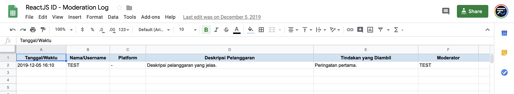

# Panduan Mengelola Komunitas

Pengelola komunitas bertugas sebagai juru kunci di komunitas yang mereka kelola. Di panduan ini, kami menyediakan sebuah [_template_ Kode Etik](CODE_OF_CONDUCT.md) yang dapat digunakan oleh komunitas _open source_ di Indonesia, serta panduan lanjutan untuk menetapkan aturan-aturan komunitas dan memoderasi komunitas sesuai dengan nilai-nilai komunitas.

## Kode Etik dan Peraturan Komunitas

Tujuan utama dari kode etik dan peraturan komunitas adalah mengkomunikasikan nilai-nilai keterbukaan dari sebuah komunitas. Hal ini dilakukan dengan cara menetapkan perilaku-perilaku yang diharapkan dan perilaku-perilaku yang tidak diperkenankan dari seluruh anggota komunitas.

Dengan menetapkan kode etik dan peraturan komuntas, diharapkan akan meningkatkan kesadaran para anggota komunitas untuk menjaga perilaku masing-masing supaya komunitas mereka tetap ramah, aman, dan nyaman bagi semua.

### Kode Etik Komunitas Open Source Indonesia

Kami menyediakan [Kode Etik Komunitas Open Source Indonesia](../CODE_OF_CONDUCT.md), sebagai _template_ kode etik yang dapat digunakan oleh komunitas-komunitas _open source_ di Indonesia.

_Template_ ini disediakan dengan [lisensi terbuka](https://creativecommons.org/licenses/by-sa/3.0/deed.id), yang memungkinkan Anda untuk menggunakan dan mengadaptasi kode etik ini dalam komunitas Anda. Kami juga telah menandai bagian-bagian yang dapat digantikan dengan informasi-informasi yang relevan untuk komunitas Anda:

- `{$NAMA_KOMUNITAS}` - ganti dengan nama komunitas Anda.
- `{$INFORMASI_KONTAK}` - ganti dengan daftar informasi kontak pihak yang dapat dihubungi apabila ada pelanggaran kode etik yang perlu dilaporkan, atau ada pertanyaan yang ingin diajukan.

### Peraturan Komunitas

Setiap komunitas _open source_ bisa saja berkomunikasi secara daring (_online_) di berbagai macam _platform_ media sosial (seperti Twitter, Facebook, dan Discord). Oleh karena itu, kami sarankan untuk menyusun peraturan komunitas sesuai dengan _platform_ media sosial yang Anda gunakan. Berikut adalah peraturan-peraturan komunitas yang dapat digunakan sebagai contoh:

- [Peraturan komunitas TypeScript](https://github.com/typescript-community/governance)

## Panduan Moderasi Komunitas

### Kriteria Moderator

**_Apakah tugas seorang moderator?_**

- Memastikan semua anggota komunitas mengikuti aturan yang telah ditetapkan
- Mengambil tindakan terhadap anggota komunitas yang melanggar peraturan komunitas atau kode etik
- Membantu memfasilitasi percakapan dalam sebuah komunitas
- Bersedia membantu anggota komunitas jika diperlukan

### Paraturan dan Nilai-nilai Komunitas

Nilai-nilai komunitas membentuk peraturan komunitas, serta sebagai panduan seorang penyelenggara untuk menilai perilaku seorang anggota komunitas, yang mungkin melanggar peraturan komunitas dan/atau Kode Etik. Nilai-nilai komunitas harus menjawab pertanyaan berikut: **_Apakah tujuan utama dari komunitas ini?_**

Apabila sebuah komunitas _open source_ berbasis di lebih dari satu _platform_ media sosial, terkadang perlu dibuat peraturan komunitas yang disesuaikan dengan media sosial tersebut.

### Catatan Aksi Moderasi

Terkadang, sebuah komunitas perlu menyimpan catatan aksi moderasi yang dapat diakses sesama moderator komunitas. Catatan ini dapat digunakan sebagai referensi bagi para moderator apabila terjadi kasus serupa di masa yang akan datang.

Contoh _template_ _spreadsheet_ yang dapat digunakan untuk mencatat aksi moderasi terhadap pihak-pihak yang melanggar kode etik serta tindakan yang diambil adalah sebagai berikut:

Silakan menyesuaikan kolom-kolom dalam _template_ ini untuk komunitas Anda masing-masing. Misalnya, dalam komunitas yang hanya tersedia dalam satu _platform_ media sosial, dapat menghilangkan kolom "Platform". dalam contoh spreadsheet ini.
